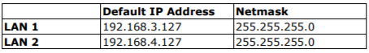

# Getting Started with AWS IoT core Guide for Moxa MC-7400 series computer

# Document Information

## Revision History (Version, Date, Description of change)

| Version | Date        | Description of change |
| ------- | ----------- | --------------------- |
| 1       | 2021/05/29 | First release         |
|         |             |                       |

# Overview

The MC-7400 box computer is powered by the 6th generation Intel Core™i processor, delivering a full range of I/O connectivity, including serial ports, Gigabit Ethernet ports, NMEA 0183 ports, USB 2.0/3.0 ports, and a Mini PCI slot for storage expansion. The MC-7400 is designed to provide outstanding PC performance, bringing a new level of flexibility and control to marine applications.

# Hardware Description


## DataSheet

[MC-7400 series](https://cdn-cms.azureedge.net/getmedia/bdf8fbe0-eeb3-451f-af21-6765f77d7d36/moxa-mc-7400-series-datasheet-v1.3.pdf)

## Standard Kit Contents

The standard shipping Moxa MC-7400 series computer package contains the following items:

- 1 x MC-7400 embedded computer
- 1 x Terminal block to power jack converter
- 1 x Wall-mounting kit
- 1 x Quick installation guide (printed)
- 1 x Warranty card

## User Provided items

To setup and operate Moxa MC-7400 series computer, users have to prepare the following items by themselves.

- 10/100/1000M Ethernet cables
- Power source: 100 to 240 VAC
- Power cord: Power cord with AU/CN/EU/UK/US plug type, Input Voltage 10A/250V, Max. Current 10A, Thickness 6.3±0.2 mm, Length 1830±30 mm

## 3rd Party purchasable items
N/A

# Set up your Hardware Environment
- **Connecting a Display**

    The MC-7400 computer come with one DVI-I and one DVI-D connectors that can connect to DVI monitors. Use the cable to connect one end to the DVI-I connector and the other end to the monitor

- **Connecting a Keyboard and Mouse**

    Connectors for a keyboard and mouse are located on the front panel of the computer. Both connectors are USB interfaces; you can directly connect a keyboard and a mouse using these connectors.

- **Powering on Moxa MC-7400 series computer :**
	
	The MC-7400 Series comes with a 100 to 240 VAC power input for AC power model, or a 24 VDC power input(via the terminal block) for DC power model. If power is supplied properly, the Power LED will light up.

- **Accessing Moxa MC-7400 series computer Using a Linux/Windows PC or Mac**

    You can use a PC to access Moxa MC-7400 series computer by using SSH over the network. Refer to the following IP addresses and login information:

    

Login: moxa

Password: moxa

Root account login is disabled until you manually create a password for the account. The user moxa is in the sudo group so you can operate system level commands with this user using the sudo command.

**ATTENTION: For security reasons, we recommend that you disable the default user account and create your own user accounts or** 

**Refer to Account Management of [Moxa MC-7400 series computer-linux-user-manual](https://www.moxa.com/getmedia/58efc9c5-5865-4aa9-9eb1-12734d28f3cb/moxa-mc-1200-series-linux-manual-v1.0.pdf) for the detail steps.**

- **Change the network settings of Moxa MC-7400 series computer based on your network environment**

    Refer to the Changing the interfaces Configuration File of [Moxa MC-7400 series computer-linux-user-manual](https://www.moxa.com/getmedia/58efc9c5-5865-4aa9-9eb1-12734d28f3cb/moxa-mc-1200-series-linux-manual-v1.0.pdf) for the detail steps.

# Set up your Development Environment

## Tools Installation (IDEs, Toolchains, SDKs)

The operation system of Moxa MC-7400 series is a native 64-bits X86 Linux operating system. There is no need to install toolchains. You can install development tools in Moxa MC-7400 series computer directly.

Follow these steps to update the package menu:

1. Make sure a network connection is available.

2. Use apt-get update to update the Debian package list.

```bash
moxa@Moxa:~$ sudo apt-get update
```

3. Install the native compiler and necessary packages.

```bash
moxa@Moxa:~$ sudo apt-get install gcc build-essential flex bison automake
```

# Setup your AWS account and Permissions

Refer to the instructions at [Set up your AWS Account](https://docs.aws.amazon.com/iot/latest/developerguide/setting-up.html). Follow the steps outlined in these sections to create your account and a user and get started:

- Sign up for an AWS account and
- Create a user and grant permissions.
- Open the AWS IoT console

Pay special attention to the Notes.

# Create Resources in AWS IoT

Refer to the instructions at [Create AWS IoT Resources](https://docs.aws.amazon.com/iot/latest/developerguide/create-iot-resources.html). Follow the steps outlined in these sections to provision resources for your Moxa MC-7400 series computer:

- Create an AWS IoT Policy
- Create a thing object

Pay special attention to the Notes.

> **Important**
Before you continue to the next step, your Moxa computer must be configured, and running. The Moxa computer must be connected to the Internet and you will need to be able to access the computer by using its command line interface. Command line access can be through SSH terminal remote interface.

# Build the demo

Follow above section, **Accessing Moxa MC-7400 series** **computer Using a Linux/Windows PC or Mac,** using PuTTY to open a remote terminal to Moxa computer on **Linux/Windows PC or Mac** and perform the following instructions in that window. 

Refer to the instruction at [Install the required tools and libraries for the AWS IoT Device SDK](https://docs.aws.amazon.com/iot/latest/developerguide/connecting-to-existing-device.html#gs-device-sdk-tools) and [Install AWS IoT Device SDK](https://docs.aws.amazon.com/iot/latest/developerguide/connecting-to-existing-device.html#gs-device-install-sdk) for Python on Moxa MC-7400 series computer directly. Follow the steps outlined in these sections to install AWS IoT Device SDK for your Moxa computer:

- Update the operating system and install required libraries
- Install git
- Install the AWS IoT Device SDK for Python.

Note: Due to using Python, there is no need to compile/build any programs. And we perform all steps in Moxa computer, there is no need to load/upload any programs to it.

# Run the demo

Continue previous section, perform the instructions, [Install and run the sample app](https://docs.aws.amazon.com/iot/latest/developerguide/connecting-to-existing-device.html#gs-device-node-app-run), in that terminal window. 

To view the MQTT messages published by the sample app in the AWS IoT console, perform the instructions,[View messages from the sample app in the AWS IoT console](https://docs.aws.amazon.com/iot/latest/developerguide/connecting-to-existing-device.html#gs-device-view-msg).

# Debugging

1. Not able to login Moxa MC-7400 series computer's through SSH terminal.

    Connect a display monitor to the Moxa MC-7400 series computer, and then power it up. Once the system is ready, a login screen will appear on your monitor. Refer to Starting from a DVI-D Console of [**Moxa MC-7400 series computer-linux-user-manual](https://www.moxa.com/getmedia/58efc9c5-5865-4aa9-9eb1-12734d28f3cb/moxa-mc-1200-series-linux-manual-v1.0.pdf)** for the detail steps. After login Moxa computer check following items:

    a. Check if IP address of LAN1/LAN2 is in the same subnet of your PC.

    b. Check if you are able to operate OS normally. If not, gather all error message when you operate OS and then [CONTACT US](https://www.moxa.com/en/support/technical-support)

2. Moxa computer is not able to access internet.

    a. Check if IP address, mask and gateway of LAN1/LAN2 are configured in /etc/network/interfaces properly.

    b. Check if routing is correct.

    c. Check if nameserver is configured in /etc/resolv.conf

# Troubleshooting

Still need assistance with your Moxa product? [CONTACT US](https://www.moxa.com/en/support/technical-support)
